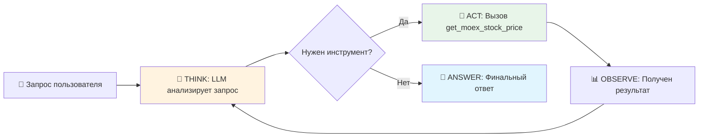
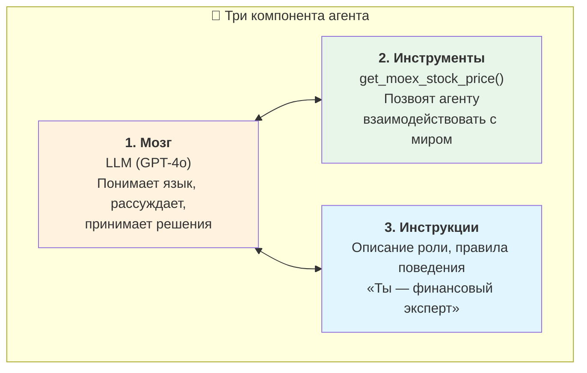
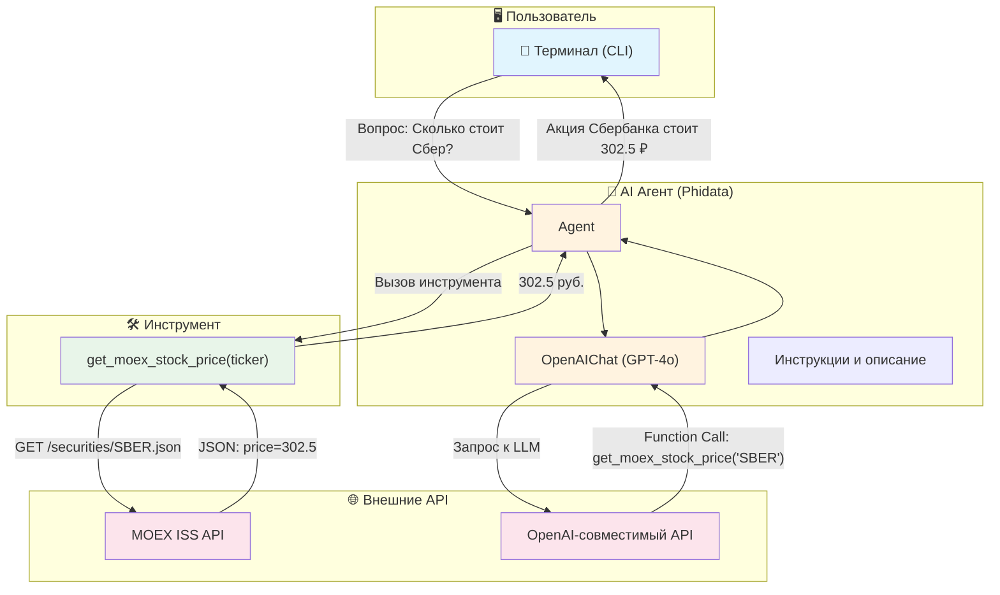

# 📈 Price Analytic Agent

**AI-агент** для анализа цен российских акций в реальном времени. Получает данные напрямую с **Московской Биржи (MOEX)** и отвечает на вопросы пользователя с помощью LLM.

---

## 🤖 В чём суть агентского подхода?

### Обычный скрипт vs Агент

Чтобы понять, зачем нужен агент, сравним два подхода:

| | 🔧 Обычный скрипт | 🤖 AI-агент |
|---|---|---|
| **Логика** | Жёстко прописана программистом | LLM **сам решает**, что делать |
| **Инструменты** | Вызываются напрямую в коде | LLM **выбирает**, какой инструмент вызвать |
| **Ввод** | Фиксированные параметры | Свободный текст на естественном языке |
| **Гибкость** | Новый сценарий = новый код | Новый сценарий = LLM разберётся сам |

**Пример разницы:**

```python
# ❌ Обычный скрипт — всё захардкожено
price_sber = get_price("SBER")
price_gazp = get_price("GAZP")
print(f"Сбер: {price_sber}, Газпром: {price_gazp}")

# ✅ Агент — понимает ЛЮБОЙ вопрос
# "Сравни Сбер и Газпром" → сам вызовет get_price 2 раза, сам сравнит, сам объяснит
# "А что насчёт Лукойла?" → сам поймёт, что нужен ещё один вызов
# "Какая акция дороже всех?" → сам решит, какие тикеры проверить
```

### Цикл ReAct (Reason + Act)

В основе любого агента лежит цикл **ReAct** — модель сначала *думает* (Reason), потом *действует* (Act):



> **Ключевое:** LLM может пройти этот цикл **несколько раз**. Например, на вопрос *«Сравни Сбер и Газпром»* агент:
> 1. **Think:** «Мне нужны цены двух акций»
> 2. **Act:** вызывает `get_moex_stock_price("SBER")` → получает 302.5
> 3. **Act:** вызывает `get_moex_stock_price("GAZP")` → получает 152.3
> 4. **Answer:** «Сбербанк (302.5₽) дороже Газпрома (152.3₽) на 150.2₽»

### Что делает это «агентским»



1. **Мозг (LLM)** — не просто генерирует текст, а *принимает решения*: какой инструмент вызвать, с какими параметрами, и когда остановиться
2. **Инструменты (Tools)** — функции, которые агент может вызывать. LLM читает их docstring и сам понимает, когда и зачем их использовать
3. **Инструкции** — задают «характер» агента: как отвечать, на каком языке, что упоминать

### Почему Function Calling — это магия

Самое важное в агентах — механизм **Function Calling**. LLM не просто генерирует текст, а возвращает структурированный вызов функции:

```json
// LLM получает вопрос "Сколько стоит Сбер?" и возвращает:
{
  "function": "get_moex_stock_price",
  "arguments": { "ticker": "SBER" }
}
// Фреймворк Phidata выполняет эту функцию и передаёт результат обратно в LLM
```

> **Важно:** программист НЕ пишет `if "сбер" in query: get_price("SBER")`. LLM сам понимает, что «Сбербанк» = тикер `SBER`, потому что читает docstring инструмента.

### 📖 Роль DocString — «инструкция для ИИ»

В обычном Python-проекте docstring — это документация для программиста. В агентском проекте docstring — это **инструкция для LLM**. Это принципиально другая роль.

Когда Phidata регистрирует инструмент, он передаёт LLM:
- **Имя функции** → `get_moex_stock_price`
- **Описание** → содержимое docstring
- **Параметры** → аргументы функции с типами

LLM читает это описание и на его основе принимает решение: **вызвать** эту функцию или нет, и **с какими аргументами**.

#### Что видит LLM

Вот что фреймворк отправляет в LLM как описание доступного инструмента:

```json
{
  "type": "function",
  "function": {
    "name": "get_moex_stock_price",
    "description": "Этим инструментом нужно пользоваться, когда тебе нужно узнать, сколько стоит одна акция российской компании прямо сейчас. Данные берутся напрямую с Московской Биржи (MOEX).",
    "parameters": {
      "type": "object",
      "properties": {
        "ticker": {
          "type": "string",
          "description": "Код акции (тикер), например 'SBER' для Сбербанка или 'GAZP' для Газпрома."
        }
      }
    }
  }
}
```

> LLM **не видит код функции** — он видит только docstring и имена параметров. Поэтому docstring = единственный способ объяснить ИИ, что делает инструмент.

#### ❌ Плохой vs ✅ Хороший DocString

```python
# ❌ ПЛОХО — LLM не поймёт, когда и как использовать
def get_moex_stock_price(ticker: str) -> str:
    """Получает цену."""

# ✅ ХОРОШО — LLM точно знает: когда вызывать, что передать, что получит
def get_moex_stock_price(ticker: str) -> str:
    """
    Этим инструментом нужно пользоваться, когда тебе нужно узнать,
    сколько стоит одна акция российской компании прямо сейчас.
    Данные берутся напрямую с Московской Биржи (MOEX).

    Args:
        ticker: Код акции (тикер), например 'SBER' для Сбербанка
                или 'GAZP' для Газпрома.

    Returns:
        Последняя цена акции в рублях.
    """
```

#### Почему это критически важно

| Аспект DocString | Влияние на агента |
|---|---|
| **Когда вызывать** (*«когда нужно узнать цену»*) | LLM понимает, на какие вопросы применять этот инструмент |
| **Примеры аргументов** (*«SBER», «GAZP»*) | LLM знает формат тикера и может сам подобрать нужный |
| **Что возвращает** (*«цена в рублях»*) | LLM правильно интерпретирует результат в ответе |
| **Ограничения** (*«российские компании»*) | LLM не будет пытаться передать `AAPL` в этот инструмент |

> 💡 **Вывод:** В агентском проекте docstring — это не комментарий для разработчика, а **контракт между человеком и ИИ**. Чем точнее и подробнее docstring, тем умнее ведёт себя агент.

---

## Архитектура проекта



---

## Стек технологий

| Компонент | Технология | Зачем |
|---|---|---|
| Фреймворк агента | [Phidata](https://github.com/phidatahq/phidata) | Оркестрация LLM + Tools + ReAct-цикл |
| LLM | GPT-4o (через OpenAI-совместимый API) | «Мозг» агента |
| Источник данных | [MOEX ISS API](https://iss.moex.com/) | Реальные цены акций |
| Язык | Python 3.12+ | — |

---

## Быстрый старт

```bash
# Клонировать репозиторий
git clone https://github.com/vsanyanov-ux/price-analytic.git
cd price-analytic

# Создать виртуальное окружение
python -m venv venv
venv\Scripts\activate    # Windows
# source venv/bin/activate  # Linux/Mac

# Установить зависимости
pip install -r requirements.txt

# Настроить переменные окружения
cp .env.example .env
# Заполнить OPENAI_API_KEY и OPENAI_BASE_URL

# Запустить агента
python agent.py
```

## Переменные окружения

| Переменная | Описание |
|---|---|
| `OPENAI_API_KEY` | Ключ API для OpenAI-совместимого сервиса |
| `OPENAI_BASE_URL` | Base URL API (например `https://api.aitunnel.ru/v1`) |

## Примеры вопросов

- *«Сколько стоит Сбербанк?»*
- *«Сравни акции Газпрома и Лукойла»*
- *«Что дороже — Яндекс или Роснефть?»*
- *«Покажи цену SBER, GAZP и YNDX»*

## Лицензия

MIT
