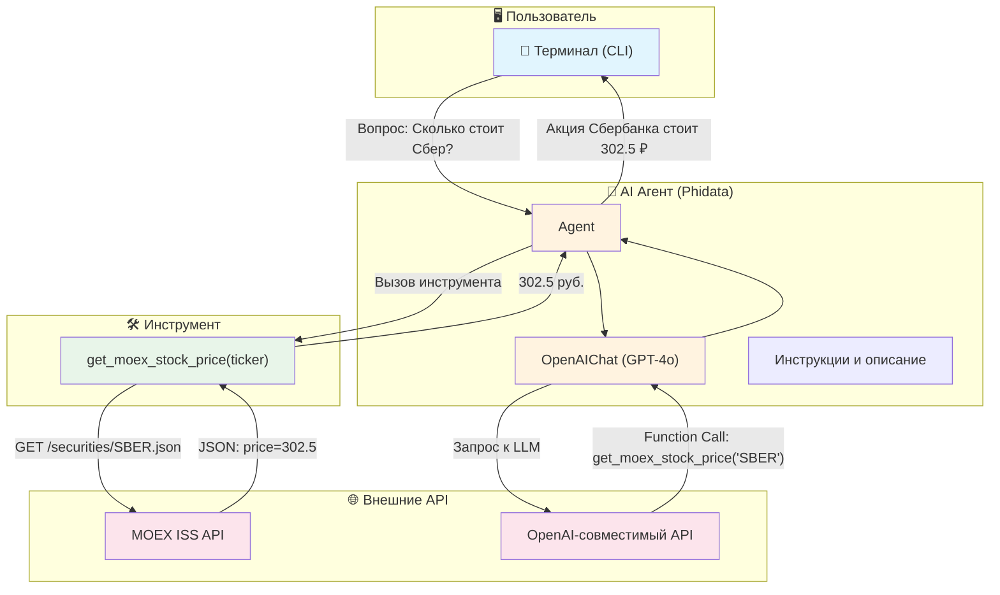

# 📈 Price Analytic Agent

AI-агент для анализа цен российских акций в реальном времени. Получает данные напрямую с **Московской Биржи (MOEX)** и отвечает на вопросы пользователя с помощью LLM.

## Архитектура



## Как это работает

1. **Пользователь** задаёт вопрос в терминале (например, *«Сравни Сбер и Газпром»*)
2. **LLM** анализирует запрос и решает вызвать инструмент `get_moex_stock_price`
3. **Инструмент** делает HTTP-запрос к API Московской Биржи (ISS MOEX)
4. **LLM** получает данные и формирует понятный ответ на русском языке

## Стек технологий

| Компонент | Технология |
|---|---|
| Фреймворк агента | [Phidata](https://github.com/phidatahq/phidata) |
| LLM | GPT-4o (через OpenAI-совместимый API) |
| Источник данных | [MOEX ISS API](https://iss.moex.com/) |
| Язык | Python 3.12+ |

## Быстрый старт

```bash
# Клонировать репозиторий
git clone https://github.com/vsanyanov-ux/price-analytic.git
cd price-analytic

# Создать виртуальное окружение
python -m venv venv
venv\Scripts\activate    # Windows
# source venv/bin/activate  # Linux/Mac

# Установить зависимости
pip install -r requirements.txt

# Настроить переменные окружения
cp .env.example .env
# Заполнить OPENAI_API_KEY и OPENAI_BASE_URL

# Запустить агента
python agent.py
```

## Переменные окружения

| Переменная | Описание |
|---|---|
| `OPENAI_API_KEY` | Ключ API для OpenAI-совместимого сервиса |
| `OPENAI_BASE_URL` | Base URL API (например `https://api.aitunnel.ru/v1`) |

## Примеры вопросов

- *«Сколько стоит Сбербанк?»*
- *«Сравни акции Газпрома и Лукойла»*
- *«Что дороже — Яндекс или Роснефть?»*
- *«Покажи цену SBER, GAZP и YNDX»*

## Лицензия

MIT
